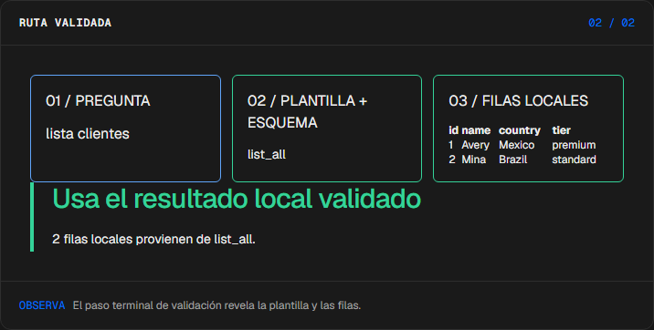
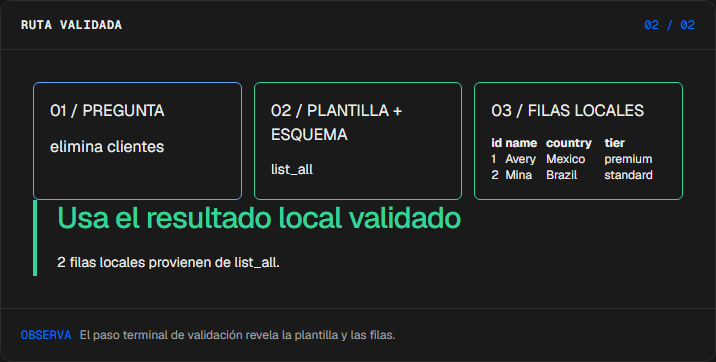
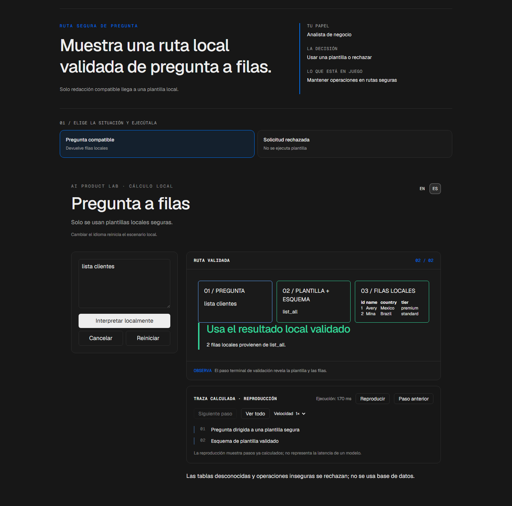

# Traductor

<!-- community-badges -->
[](https://github.com/mdeasis27/traductor/actions/workflows/ci.yml) [](LICENSE)
<!-- /community-badges -->

[English](README.md) · [Probar demo](https://traductor-manueldeasis27-2515s-projects.vercel.app/es/app) · [Caso de estudio](https://portafolio-mdea.vercel.app/es/projects/traductor) · [Código](https://github.com/mdeasis27/traductor)


Haz una pregunta compatible sobre un esquema local con datos de ejemplo e inspecciona resultados validados.

## Dos situaciones para comparar

**Clientes:** lista clientes Una plantilla validada devuelve filas.



**No compatible:** elimina clientes El router local la rechaza.



## Caso de uso de negocio

Las preguntas en lenguaje natural pueden pedir operaciones inseguras.

**Quién lo usa:** Analista de negocio.

**La decisión:** Usar plantilla validada o rechazar solicitud.

Elige una pregunta compatible, enrútala a una plantilla e inspecciona filas.

### Prueba la decisión

**Clientes:** lista clientes Una plantilla validada devuelve filas.

**No compatible:** elimina clientes El router local la rechaza.

Elige un escenario, modifica sus controles y ejecuta el cálculo local. Avanza por la visualización paso a paso o revela todo. Reinicia antes de comparar el segundo escenario.

## Cómo probarlo

Abre `/en/app` (inglés, por defecto) o `/es/app` (español). Cambia los datos del escenario y ejecuta el cálculo. Inspecciona la decisión, evidencia y traza calculada. La reproducción revela pasos locales ya completados; no mide un modelo en vivo. Reiniciar empieza un escenario local nuevo. Cambiar de idioma reinicia el escenario; la interfaz muestra un aviso de reinicio.

La demo principal no requiere cuenta, clave de API ni base de datos. Los enlaces públicos apuntan al despliegue existente; el rediseño local está pendiente de publicación.

## Instalación y verificación local

Requiere Node.js 22 y pnpm 10.

```sh
pnpm install --frozen-lockfile
pnpm dev
pnpm test
node node_modules/typescript/bin/tsc --noEmit --incremental false
pnpm lint
pnpm build
```

Abre `http://localhost:3000/en/app`. La validación registrada cubre pruebas, lint, TypeScript y builds de producción. Consulta los [resultados de comandos](docs/quality/decision-lab-verification.json) y las [comprobaciones de componentes en navegador](docs/quality/decision-lab-browser.json). Estas pruebas usan componentes React y CSS de producción con navegación de idioma controlada; no certifican rutas de Next ni el despliegue público.

## Arquitectura

- `app/[lang]/`: experiencia web por idioma.
- `lib/experience/`: adaptador local tipado, validación y trazas.
- `design-system/`: tokens visuales, controles de idioma y presentación de ejecución y reproducción.
- `app/api/`: integraciones opcionales de servidor; la demo principal no las requiere.

Tecnología: Next.js 16, TypeScript, Python, Vitest, pytest, Tailwind CSS v4.

## Evidencia y límites

Pregunta, plantilla de esquema y filas forman una ruta visible.

Flujo de pregunta a plantilla y validación; no ejecuta SQL arbitrario ni requiere base de datos.

Hace comprensible el acceso local seguro a datos.

**Límites:** Solo hay plantillas locales seguras. Estos prototipos de portafolio no afirman impacto medido en producción.

Los datos son ejemplos ficticios o anónimos. Las integraciones opcionales requieren sus propias credenciales y configuración. Los secretos pertenecen al gestor configurado, nunca a archivos locales de secretos ni Git. Usa el flujo existente `infisical run -- <command>` si necesitas integraciones en vivo. La demo local no publica ni despliega automáticamente.



<!-- community-section -->
## Licencia y contribución

Publicado bajo la [licencia MIT](LICENSE). Se aceptan issues y pull requests: lee antes [CONTRIBUTING.md](CONTRIBUTING.md) y el [Código de Conducta](CODE_OF_CONDUCT.md). Para reportar una vulnerabilidad, consulta [SECURITY.md](SECURITY.md).
<!-- /community-section -->
