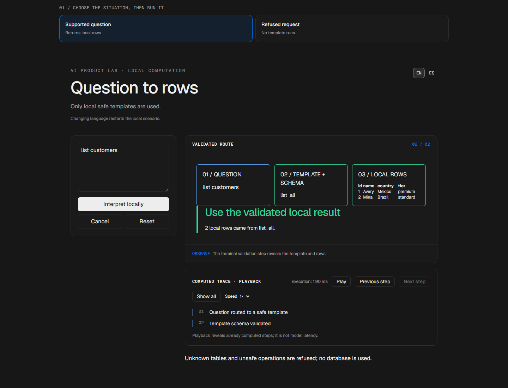
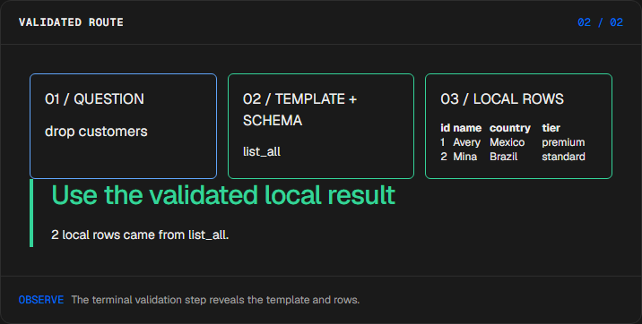
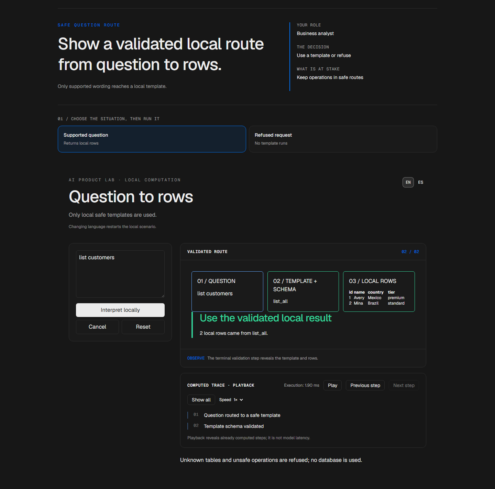

# Business query translator

[Español](README.es.md) · [Try the demo](https://traductor-manueldeasis27-2515s-projects.vercel.app/en/app) · [Case study](https://manueldeasis.com/en/projects/traductor) · [Source](https://github.com/mdeasis27/traductor)



Ask a supported question over a seeded local schema and inspect validated results.

## Two situations to compare

**Customers:** list customers A validated template returns rows.


**Unsupported:** drop customers The local router refuses it.



## Business use case

Natural language questions can request unsafe data operations.

**Who uses it:** Business analyst.

**The decision:** Use a validated template or refuse the request.

Choose a supported question, route it to a template, and inspect returned rows.

### Try the decision

**Customers:** list customers A validated template returns rows.

**Unsupported:** drop customers The local router refuses it.

Choose a scenario, edit its controls and run the local computation. Step through the visual process or reveal all steps. Reset before comparing the second scenario.

## How to try it

Open `/en/app` (English, default) or `/es/app` (Spanish). Change the scenario inputs and run the computation. Inspect the resulting decision, evidence and computed trace. Playback reveals completed local steps; it does not measure a live model. Reset starts a new local scenario. Changing language resets the scenario; the interface displays a reset notice.

The primary demo needs no account, API key or database. Public links refer to the existing deployment; local redesign changes are pending publication.

## Local setup and verification

Requires Node.js 22 and pnpm 10.

```sh
pnpm install --frozen-lockfile
pnpm dev
pnpm test
node node_modules/typescript/bin/tsc --noEmit --incremental false
pnpm lint
pnpm build
```

Open `http://localhost:3000/en/app`. Recorded validation covers tests, lint, TypeScript and production builds. See [command results](docs/quality/decision-lab-verification.json) and [browser component checks](docs/quality/decision-lab-browser.json). The new browser checks exercise real React components and production CSS with controlled locale navigation; they do not certify Next routes or public deployment.

## Architecture

- `app/[lang]/`: localized browser experience.
- `lib/experience/`: typed local adapter, validation and run traces.
- `design-system/`: shared visual tokens, locale controls and execution/replay presentation.
- `app/api/`: optional server integrations; the primary demo does not require them.

Technology: Next.js 16, TypeScript, Python, Vitest, pytest, Tailwind CSS v4.

## Evidence and limitations

Question, schema template, and rows form a visible path.

Question-to-template-to-validation flow; no arbitrary SQL execution or database is required.

Makes safe local data access understandable.

**Limits:** Only local safe templates are available. These portfolio prototypes do not claim measured production impact.

Inputs use fictional or anonymized examples. Optional live integrations require their own credentials and operational setup. Secrets belong in the configured secret manager, never in local secret files or Git. Use the existing `infisical run -- <command>` workflow when live integration is needed. This repository does not publish or deploy automatically as part of the local demo.


